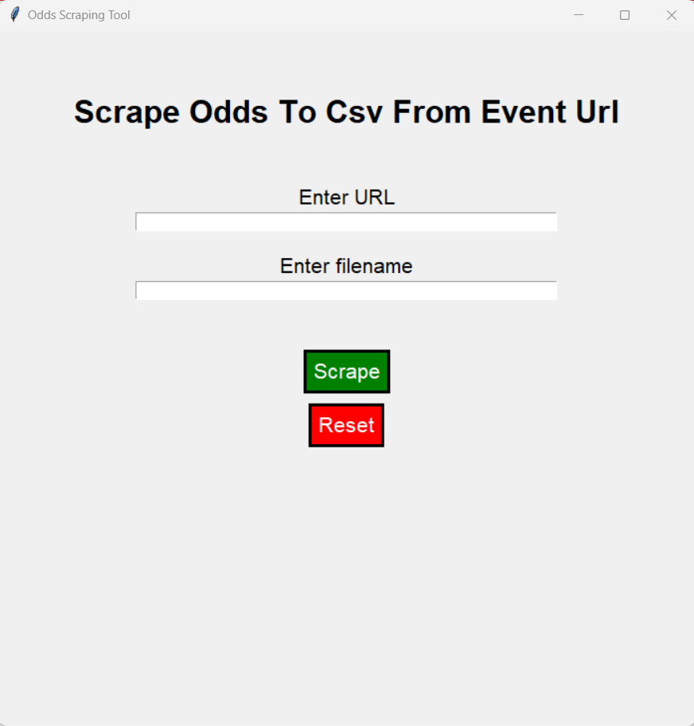
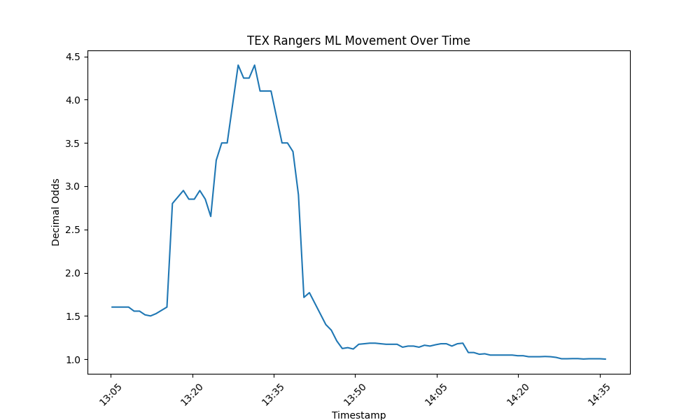

# Sportsbook Odds Scraper

## Overview

sportsbook-odds-scraper is a Python library that fetches the current odds being offered by various different sportsbooks in North America and Australia.

The user inputs a match URL from a supported sportsbook and the library returns all available markets and odds in a normalized pandas dataframe. There is also an option to write to CSV format.

Every visible market type and selection is queried, not just core markets. Suspended/hidden betting options are ignored. Treatment is the same for live and pregame matches.

Instead of parsing the html, data is requested through the sportsbooks' (undocumented) APIs. Accordingly, no SLA can be given as the sites may change without warning or block your traffic.

A [GUI](#gui) is provided. Alternatively, the EventScraper class can be used as part of an analytics workflow (see [examples](#sample)). 

### Supported Sportsbooks

- DraftKings
- BetMGM
- Caesars
- BetRivers/Sugarhouse
- Superbook
- Bovada
- SportsBet (Aus)^
- TAB (Aus) -- Appears to be behind strong bot-detection
- Ladbrokes (Aus)
- PointsBet (Aus)

_NB: Sportsbooks may reject http requests based on your IP location. Use a VPN when trying to scrape odds from overseas._

_^SportsBet is very slow to scrape because you have to make a separate http request for each market grouping_

## Getting Started

### Clone the Repository

Assuming you have [Git](https://git-scm.com/) installed on your computer, open your terminal and run:

```bash
git clone https://github.com/declanwalpole/sportsbook-odds-scraper.git
```

### Navigate to the Directory

```bash
cd sportsbook-odds-scraper
```

### Install Dependencies

```bash
pip install -r requirements.txt
```

# Usage

## Running the GUI
<a name="gui"></a>
```powershell
python app.py
```
<p align="center">
    
</p>

## Running the code

```python
# Import the EventScraper class
from event_scraper import EventScraper

# Create an instance of the EventScraper class
scraper = EventScraper()

# Set scraper input parameters
url = "www.example_sportsbook.com/event-123"

# Scrape the URL
scraper.scrape(url)

# Preview the pandas df of scraped odds
print(scraper.odds_df.head())
```

# Sample Use Cases
<a name="sample"></a>
## Time Series of Live MLB Game Odds

Suppose you are interested in how odds fluctuate through time. We can repeatedly scrape the same match url to accumulate a history of lines and odds.

BOS Red Sox @ TEX Rangers (2023-09-20) was offered live in-play by DraftKings US. Although BOS got out to a 4 run lead early, TEX scored 15 runs unanswered between the bottom and of 2nd and the 6th innings.

Here's how we scraped that every minute.

```python
sleep_time = 60  # sleep for 60 seconds between scrapes
num_iterations = 240  # Repeat 240 times (4hrs to cover duration of game)
url = "https://sportsbook.draftkings.com/event/bos-red-sox-%40-tex-rangers/29372173"

dfs = []

for i in range(num_iterations):
    print(f"Scraper running #{i+1} of {num_iterations}...")

    scraper = EventScraper()
    scraper.scrape(url)

    if scraper.error_message:
        print(f"Error encountered: {scraper.error_message}")
    elif scraper.odds_df is not None:
        print(f"Scrape successful")
        scraper.odds_df['timestamp'] = scraper.request_start_timestamp
        dfs.append(scraper.odds_df)

    time.sleep(sleep_time)

all_odds_df = pd.concat(dfs, ignore_index=True)
```

The rows of `all_odds_df` contain timestamped odds for every selection, per repetition. The live fullgame moneyline selection for TEX Rangers was 0ML72031526_3. Let's chart the time series of the moneyline price.

```python
selection_filter = "0ML72031526_3"
filtered_df = all_odds_df[all_odds_df['selection_id'] == selection_filter]

plt.plot(filtered_df['timestamp'], filtered_df['odds'])
plt.show()
```
<p align="center">
    
</p>

## Distribution of WNBA Totals

Suppose your betting analysis relies on an understanding of the probability distribution of fullgame total points for an WNBA match. Assuming it's Gaussian, let's try to estimate the standard deviation implied by bookies prices.

CON Sun @ MIN Lynx (2023-09-20) had the over/under set at 156.5. However BetRivers Illinois was also offering pregame alternate totals - every half point from 147.5 to 166.0. The market_name was "Total Points".

So let's scrape that information.

```python
from event_scraper import EventScraper
import pandas as pd

url = "https://il.betrivers.com/?page=sportsbook#event/1020110946"

# Initialize and scrape
eventScraper = EventScraper()
eventScraper.scrape(url)

# Extract DataFrame and filter just Total Points
odds_df = eventScraper.odds_df
filtered_df = odds_df[odds_df['market_name'] == 'Total Points']
```

Each row of the dataframe now has `selection_name` as either "Over" or "Under". Let's wrangle the data into new format with one row per market. Column names `line`, `over_odds` and `under_odds`.

```python
wrangled_df = filtered_df.groupby('line').apply(
    lambda x: pd.Series({
        'over_odds': x.loc[x['selection_name'] == 'Over', 'odds'].values[0],
        'under_odds': x.loc[x['selection_name'] == 'Under', 'odds'].values[0]
    })
).reset_index()
```

Imply the probability from the odds.

```python
df_pivot['over_prob'] = (1 / df_pivot['Over']) / ((1 / df_pivot['Over']) + (1 / df_pivot['Under']))
df_pivot['under_prob'] = 1 - df_pivot['over_prob']
```

Now we can find the Gaussian distribution of total points implied by the market.

```python
from scipy.stats import norm
from sklearn.linear_model import LinearRegression

def estimate_normal_distribution_parameters(lines, prob):

    # prob implies a zscore
    z_scores = norm.ppf(prob)

    # fit regression: line = mean + stdev * zscore
    y = lines.values
    X = z_scores.reshape(-1, 1)
    reg = LinearRegression().fit(X, y)

    # mean is intercept, stdev is slope
    mu_est = reg.intercept_
    sigma_est = reg.coef_[0]

    return mu_est, sigma_est

mean, stdev = estimate_normal_distribution_parameters(df_pivot['line'], df_pivot['under_prob'])
```

In this case, `mean` was 156.54 and `stdev` was 16.00 according to BetRivers.
